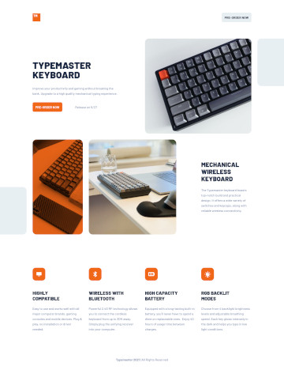
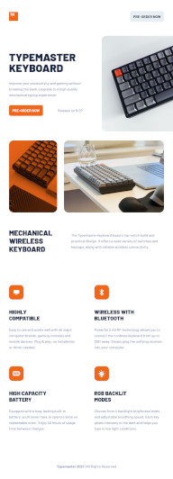
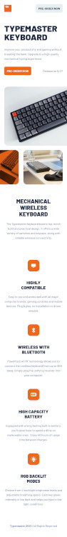

# Frontend Mentor - Typemaster pre-launch landing page solution

This is a solution to the [Typemaster pre-launch landing page challenge on Frontend Mentor](). Frontend Mentor challenges help you improve your coding skills by building realistic projects.

## Table of contents

- [Frontend Mentor - Typemaster pre-launch landing page solution](#frontend-mentor---typemaster-pre-launch-landing-page-solution)
  - [Table of contents](#table-of-contents)
  - [Overview](#overview)
    - [The challenge](#the-challenge)
    - [Screenshot](#screenshot)
    - [Links](#links)
  - [My process](#my-process)
    - [Built with](#built-with)
  - [Author](#author)

## Overview

### The challenge

Users should be able to:

-

### Screenshot
| Desktop                       | Tablet                       | Mobile                       |
|-------------------------------|------------------------------|------------------------------|
|  |  |  |

### Links

- Solution URL: [https://github.com/teempe/frontend-mentor-typemaster-pre-launch-landing-page.git](https://github.com/teempe/frontend-mentor-typemaster-pre-launch-landing-page.git)
- Live Site URL: [https://teempe.github.io/frontend-mentor-typemaster-pre-launch-landing-page/](https://teempe.github.io/frontend-mentor-typemaster-pre-launch-landing-page/)

## My process

### Built with

- Semantic HTML5 markup
- CSS custom properties
- Flexbox
- CSS Grid
- Mobile-first workflow
- [Sass](https://sass-lang.com/)

## Author

- Website - [teempe](https://github.com/teempe)
- Frontend Mentor - [@teempe](https://www.frontendmentor.io/profile/teempe)
